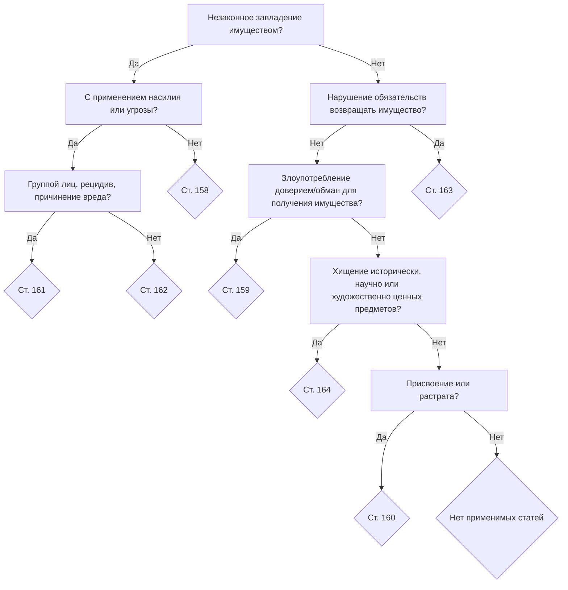

# laws-application



С начала проверяется, было ли незаконное завладение имуществом.
Если да, то проверяется, было ли оно с применением насилия или угрозы.
Если применялось насилие или угроза, проверяется участие группы лиц, рецидив или причинение вреда: если да, ст. 161, если нет - ст. 162.
Если насилие или угроза не применялись, применяется ст. 158.
Если незаконного завладения имуществом не было, проверяется, были ли нарушены обязательства по возврату имущества: если да, ст. 163.
Если обязательства не нарушались, проверяется наличие злоупотребления доверием или обмана: если да, ст. 159.
Если их не было, проверяется наличие хищения исторически, научно или художественно ценных предметов: если да, ст. 164.
Если их не было, проверяется наличие присвоения или растраты: если да, ст. 160.
Если и их не было, уголовные статьи с 158 по 164 не применяются.

```js
function getApplicableArticles(caseFacts) {
    let applicableArticles = [];

    caseFacts.forEach(fact => {
        if (fact.unlawfulDeprivationOfProperty) {
            if (fact.immediateDangerToLife || fact.useOfForce) {
                applicableArticles.push(161);
                if (fact.groupConspiracy || fact.significantDamage) {
                    applicableArticles.push(162);
                }
            } else {
                applicableArticles.push(158);
            }
        }

        if (fact.unlawfulAquiring) {
            applicableArticles.push(159);
        }

        if (fact.specialValueItemTheft) {
            applicableArticles.push(164);
        }

        if (fact.personInPossessionOfProperty) {
            applicableArticles.push(160);
        }
    });

    return applicableArticles;
}
```

    
    
    
    
    
